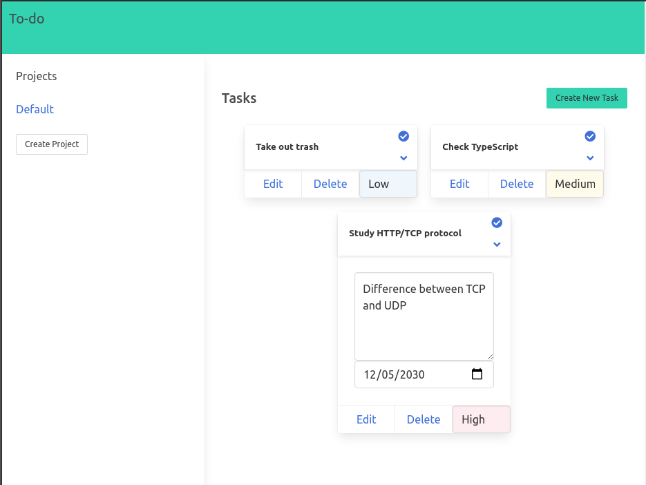

# To-do App

> This project is a To-Do app built with webpack and javascript ES6 modules

## Built With

- Javascript
- HTML
- CSS
- Bulma
- ESLint
- Stylelint
- Webpack
- yarn
- Jest

## Getting Started

To run this project locally, make sure you have the following installed:

- Node.js more information [here](https://nodejs.org/en/)
- Yarn package manager, more information [here](https://yarnpkg.com/)

### Setup and Install

- Clone this repository using the link above (click on the 'code' button)
- Open a terminal and `cd` to the cloned repository
- Run `yarn install` to set up all dependencies
- Run `yarn build` to bundle all scripts

### Usage

- `cd` into `dist/` and open `index.html`
- Open the `index.html` file with your browser

### Running tests

To run the tests you need to first install all dependencies following Setup and Install section above.

After that:
- Run the command `yarn test` on the root directory to run all tests

## Authors

👤 **Gustavo Carvalho**

- GitHub: [@gscarv13](https://github.com/gscarv13)
- Twitter: [@Gscarv13](https://twitter.com/Gscarv13)
- LinkedIn: [Gustavo Carvalho](www.linkedin.com/in/gscarv13)

## 🤝 Contributing

Contributions, issues, and feature requests are welcome!

Feel free to check the [issues page](https://github.com/gscarv13/todo-list-app/issues).

## Show your support

Give a ⭐️ if you like this project!

## 📝 License

This project is [MIT](LICENSE) licensed.
